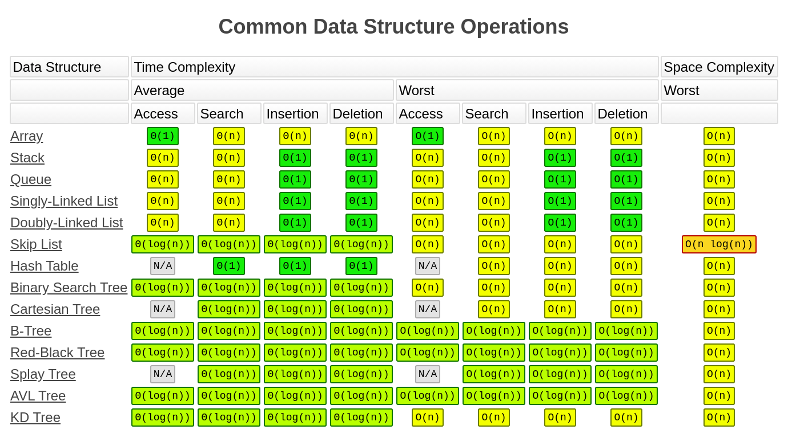

学习总结
# 复杂度
1. 时间复杂度
1. 空间复杂度
复杂度量级 - Big O notation
O(1): Constant Complexity 常数复杂度
O(logn): Logarithmic Complexity 对数复杂度
O(n): Linear Complexity 线性复杂度
O(nlogn): Log-Linear Time Complexity 线性对数复杂度
O(n^2), O(n^3), ..., O(n^k): N square, cubic ... 平方，立方 
O(2^n): Exponential Complexity: 指数复杂度
O(n!): Factorial 阶乘复杂度

# 数据结构
* 一维：
  * 基础: 数组array(string), 链表 linked list
  * 高级: 栈stack, 队列queue, 双端队列deque, 结合set, 映射map(hash or map) etc
* 二维：
  * 基础: 树tree, 图graph
  * 高级: 二叉搜索树binary search tree(red-black tree, AVL)，堆heap, 并查集disjoint set, 字典树Trie, etc
* 特殊：
  * 位运算Bitwise 
  * 布隆过滤器BloomFilter
  * LRU Cache

# 算法
* If-else, switch ---> branch
* for, while loop ---> iteration
* 递归Recursion(Divide & Conquer, Backtrace)
* 搜索Search: 深度优先搜索Depth first search, 广度优先搜索Breadth first search, A\*, etc
* 动态规划 Dynamic Programming
* 二分查找 Binary Search
* 贪心 Greedy
* 数学Math, 几何Geometry

# 化繁为简的思想
1. 人肉递归低效、很累
1. 找到最近最简方法，将其拆解成可重复解决的问题
1. 数学归纳法思维
本质：寻找重复性 ---> 计算机指令集

# 学习要点
* 深厚基本功，过遍数
* 最大的误区：只做一遍
* 五毒神掌
* 刻意联系 - 练习缺陷弱点地方、不舒服、枯燥
* 反馈 - 看题解、看国际版的高票回答
