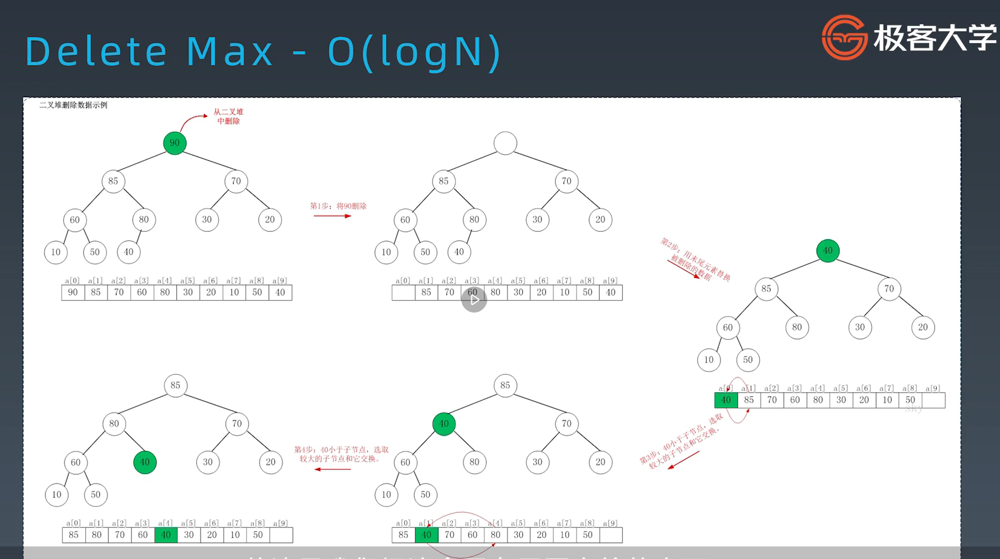

# 第二周学习笔记
## 哈希表、映射和集合
### 哈希表(Hash Table)
也叫散列表，是根据关键码值(Key value)而直接进行访问的数据结构。
它通过把关健码值映射到表中一个位置来访问记录，以加快查找的速度。
这个映射函数叫做**散列(Hash Function)**，存放记录的数组叫做哈希表（或散列表）。

工程实践
* 电话号码簿
* 用户信息表
* 缓存(LRU Cache)
* 键值对存储(Redis)

### 映射(Map)
key-value对，key不重复

### 集合(Set)
不重复元素的集合

## 树、二叉树、二叉搜索树
树(Tree)是特殊化的图(Graph), 树和图最关键的差别是有没有**环**


### 二叉树遍历Pre-order/In-order/Post-order
1. 前序（Pre-order）：根-左-右
1. 中序（Pre-order）：左-根-右
1. 后序（Pre-order）：左-右-根

示例代码
```
def perorder(self, root):
    if root:
        self.traverse_path.append(root.val)
        self.preorder(root.left)
        self.preorder(root.right)

def inorder(self, root):
    if root:
        self.inorder(root.left)
        self.traverse_path.append(root.val)
        self.inorder(root.right)

def postorder(self, root):
    if root:
        self.postorder(root.left)
        self.postorder(root.right)
        self.traverse_path.append(root.val)
```

### 二叉搜索树(Binary Search Tree)
也称二叉排序树、有序二叉树(Ordered Binary Tree)、排序二叉树(Sorted Binary Tree)，具有下列性质：
1. 左子树上**所有节点**的值均小于它的根节点的值
1. 右子树上**所有节点**的值均大于它的根节点的值
1. 以此类推：左、右子树也分别是二叉查找树

中序遍历：升序排列

常见操作
1. 查询 (Average: O(log(n), Worst, O(log(n)))
1. 插入新节点（创建）(Average: O(log(n), Worst, O(log(n)))
1. 删除 (Average: O(log(n), Worst, O(log(n)))

## 堆、二叉堆、图
### 堆(Heap)
可以迅速找到一堆数中的最大值或者最小值的数据结构。
根节点最大的堆叫做大顶堆或这大根堆，根节点最小的堆叫做小顶堆或小根堆。常见的堆有二叉堆、斐波那契堆等。
假设是大顶堆，常见操作:
```
find-max:	O(1)
delete-max:	O(logN)
insert(create):	O(logN) or O(1)
```
### 二叉堆
通过完全二叉树来实现(注意：不是二叉搜索树)
二叉堆（大顶）满足下列性质：
* 是一棵完全树
* 树中任意节点的值总是>=其子节点的值

二叉堆实现细节
1. 二叉堆一般都通过“数组”来实现
1. 假设第一个元素在数组中的索引位0的话，则父节点和子节点的位置关系如下：
  * 索引为i的左孩子的索引是(2\*i + 1)
  * 索引位i的有孩子的索引是(2\*i + 2)
  * 索引位i的父节点的索引是floor((i-1)/2)

插入操作(O(logN))
1. 新元素一律先插入堆的尾部
1. 依次向上调整整个堆的结构(一直到根即可)，HeapifyUp

Delete Max删除顶堆操作(O(logN))
1. 将堆尾元素替换到顶部(即堆顶被替代删除掉)
1. 依次从根部向下调整整个堆的结构（一直到堆尾即可），HeapifyDown


> 注意：二叉堆是堆(优先队列priority_queue)
> 的一种常见且简单的实现，但是并不是最优的实现

### 图
图的属性
* Graph(V, E)
* V - vertex: 点
  1. 度 - 入度和出度
  1. 点与点之间：连通与否
* E - edge:边
  1. 有向和无向(单行线)
  1. 权重（边长）

图的表示和分类


基于图的常见算法
1. DFS
DFS代码 - 递归写法
```
visited = set() # 和树中的DFS最大区别

def dfs(node, visited):
    if node in visited: # terminator
        # already visited
        return

    visited.add(node)

    # process current node here.
    ...
    for next_node in node.children():
        if not next_node in visited:
            dfs(next_node, visited)
```
1. BFS
```
def BFS(graph, start, end):
    queue = []
    queue.append([start])

    visited = set() # 和树中的BFS的最大区别
 
    while queue:
        node = queue.pop()
        visited.add(node)

        process(node)
        node = generate_related_nodes(node)
        queue.push(nodes)
```
