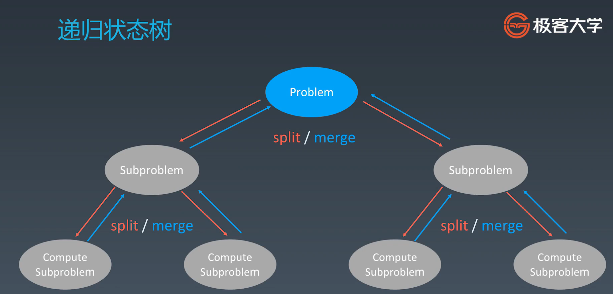

# 泛型递归、树的递归、分治、回溯
## 递归Recursion
递归 - 循环
通过函数体来进行的循环

递归Python代码模板
```python
def recursion(level, param1, param2, ...):
    # recursion terminator
    if level > MAX_LEVEL:
        process_result
        return

    # process logic in current level
    process(level, data...)

    # drill down
    self.recursion(level+1, p1, ...)

    # reverse the current level status if needed
```

**思维要点**
1. 不要人肉进行递归（最大误区）
1. 找到最近最简方法，将其拆解成可重复解决的问题（重复子问题）
1. 数学归纳法思维

## 分治
分治是一种特殊的递归，找最近的重复性或最优重复性。
一个问题分解成几个子问题。
自顶向下编程思想


**分治代码模板**
```python
def divide_conquer(problem, param1, param2, ...):
    # recursion terminator
    if problem is None:
        print_result
        return
    
    # prepare data
    data = prepare_data(problem)
    subproblems = split_problem(problem, data)
    # conquer subproblems
    subresult1 = self.divide_conquer(subproblems[0], p1, ...)
    subresult2 = self.divide_conquer(subproblems[1], p1, ...)
    subresult3 = self.divide_conquer(subproblems[2], p1, ...)
    ...
    # process and generate the final result
    result = process_result(subresult1, subresult2, subresult3, ...)

    # revert the current level states
```
## 回溯（Backtracking）
回溯法采用试错的思想，它尝试分步的去解决一个问题。再分步解决问题的过程中，当它通过尝试发现现有的分步答案不能得到有效的正确的解答的时候，它将取消上一步甚至是上几步的计算，再通过其它的可能的分步解答再次尝试寻找问题的答案。

回溯法通常用最简单的递归方法来实现，在反复重复上述的步骤后可能出现两种情况：
* 找到一个可能存在的正确答案
* 在尝试了所有可能的分步方法后宣告该问题没有答案

在最坏的情况下，回溯法会导致一次复杂度为指数时间的计算
