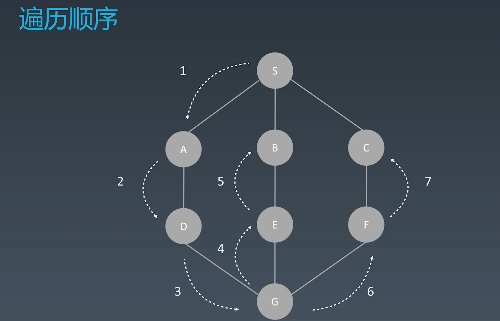
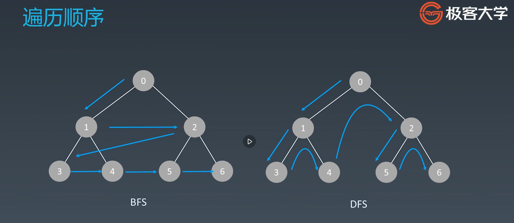

# 深度/广度优先搜索，贪心算法和二分查找
## 深度优先搜索和广度有先搜索
搜索-遍历
* 每个节点都要访问一次
* 每个节点仅仅要访问一次
* 对于节点的访问顺序不限
  * 深度优先: depth first search
  * 广度优先: breadth first search

DFS代码模板
```python
# 递归写法
visited = set()

def dfs(node, visited):
    if node in visited: # terminator
        # already visited
        # return

    visited.add(node)

    # process current node here.
    for next_node in node.children():
        if next_node not in visited:
            dfs(next_node, visited)

# 非递归写法:
def DFS(self, tree):
    if tree.root is None:
        return []

    visited, stack = [], [tree.root]

    while stack:
        node = stack.pop()
        visited.add(node)

        process(node)
        nodes = generate_related_nodes(node)
        stack.push(nodes)

    # Other processing work
    ...
```


BFS代码模板
```python
def BFS(graph, start, end):
    visited = set()
    queue = []
    queue.append([start])

    while queue:
        node = queue.pop()
        visited.add(node)

        process(node)
        nodes = generate_related_nodes(node)
        queue.push(nodes)

    # other processing work
    ...
```


## 贪心算法(Greedy)
贪心算法是一种在每一步选择中都采取在当前状态下最好或最优(即最有利)的选择，从而希望导致结果是全局最好或最优的算法。

贪心算法与动态规划的不同在于它对每个子问题的解决方案都做出选择，不能回退。动态规划则会保存以前的运算结果，并根据以前的结果对当前进行选择，有回退功能。

> 贪心：当下做局部最优判断
> 回溯：能够回退
> 动态规划：最优判断 + 回退

贪心法可以解决一些最优化的问题，如：求图中的最小生成树、求哈夫曼编码等。然而对于工程和生活中的问题，贪心法一般不能得到我们所要求的答案。

### 适用贪心算法的场景
问题能够分解成子问题来解决，子问题的最优解能递推到最终问题的最优解。这种子问题最优解称为最优子结构。

贪心算法与动态规划的不同在与它对每个子问题的解决方案都做出选择，不能回退。动态规划则会保存以前的运算结果，并根据以前的结果对当前进行选择，有回退功能。


## 二分查找
二分查找的前提
1. 目标函数单调性(单调递增或递减)
1. 存在上下界(bounded)
1. 能够通过索引访问(index accessible)

代码模板
```python
left, right = 0, len(array) - 1
while left <= right:
    mid = (left + right) / 2
    if array[mid] == target:
        # find the target!!
        break or return result
    elif array[mid] < target:
        left = mid + 1
    else:
        right = mid - 1
```
