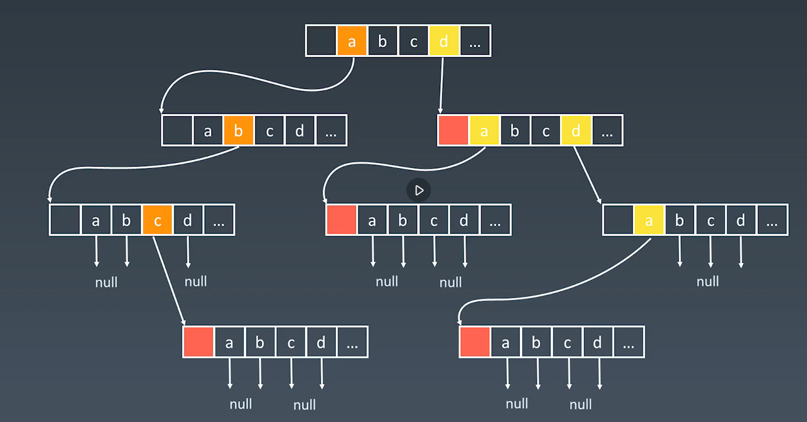

# 第7周学习笔记
## Trie树的基本实现和特性
### 基本结构
字典树，即Trie树，又成单词查找树或键树，是一种树形结构。典型应用是用于统计和排序大量的字符串（但不限于字符串），所以经常被搜索引擎习题哦嗯用于文本字频统计。

它的优点是：最大限度地减少五味的字符串比较，查询效率比哈希表高。

### 基本性质
1. 节点本身不存完整单词
1. 从根节点到某一节点，路径上经过的字符链接起来，为该节点对应的字符串
1. 每个节点的所有子节点路径代表的字符都不相同

### 核心思想
Trie树的核心思想是空间换时间
利用字符串的公共前缀来降低查询时间的开销以达到提高效率的目的

## 高级搜索
* 剪枝
* 双向BFS
* 启发式搜索(A\*)

初级搜索
1. 朴素搜索
1. 优化方式：不重复(fibonacci), 剪枝（生成括号问题）
1. 搜索方向：
   DFS: depth first search 深度优先搜索
   BFS: breadth first search 广度优先搜索

   双向搜索，启发式搜索

## 红黑树和AVL树
### AVL树
1. 发明者G.M.Adelson-Velsky和Evgenii Landis
1. Balance Factor(平衡因子):
   是它的左子树的高度减去它的右子树的高度（有时相反）
   balance factor = {-1, 0, 1}
1. 通过旋转操作来进行平衡（四种）
1. https://en.wikipedia.org/wiki/Self-balancing_binary_search_tree

旋转操作
1. 左旋
1. 右旋
1. 左右旋
1. 右左旋

AVL总结
1. 平衡二叉搜索树
1. 每个节点存balance factor = {-1, 0, 1}
1. 四种旋转操作
不足：节点需要存储额外信息、且调整次数频繁

### 红黑树(Red-black Tree)
红黑树是一种**近似平衡**的二叉搜索树(Binary Search Tree)，它能够确保任何一个节点的左右子树的**高度差小于两倍**。具体来说，红黑树是满足如下条件的二叉搜索树：
* 每个节点要么是红色，要么是黑色
* 根节点是黑色
* 每个叶节点(NIL节点，空节点)是黑色的
* 不能有相邻接的两个红色节点
* 从任一节点到其每个叶子的所有路径都包含相同数目的黑色节点

对比
* AVL trees provide **faster lookups** tan Red Black Trees because they are **most strictly balanced**.
* Red Black Trees provide **faster insertion and removal** operations than AVL trees as fewer rotations are done due to relatively relaxed balncing.
* AVL trees store balance **factors or heights** with each node, thus requires storage for an integer per node whereas Red Black Tree requires only 1 bit of information per node.
* Red Black Trees are used in most of the **language libraries like map, multimap, multisetin C++** whereas AVL trees are used in databases where faster retrievals are required.
