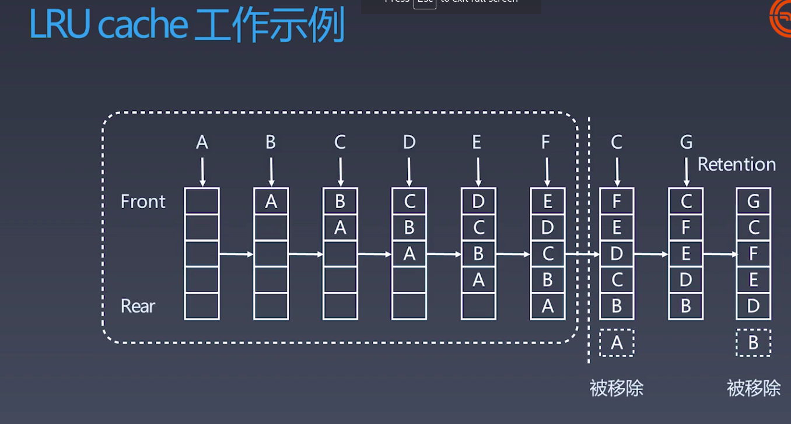

# 第8周学习笔记
## 位运算
为什么需要位运算
* 机器里的数字表示方式和存储个是就是二进制
* 十进制 <--> 二进制

位运算符
含义       | 运算符 | 示例
-----------|--------|-----
左移       |   <<   | 0011 => 0110
右移       |   >>   | 0110 => 0011
按位或     |   \|   | 0011 \| 1011 => 1011
按位与     |   &    | 0011 & 1011 => 0011
按位取反   |   ~    | 0011 => 1100
按位异或   |   ^    | 0011 ^ 1011 => 1000

指定位置的位运算
1. 将x最有边的n位清零: x & (~0 << n)
1. 获取x的第n位值（0或者1）:(x >> n) & 1
1. 获取x的第n位的幂值: x & (1 << n)
1. 仅将第n位置为1: x | (1 << n)
1. 仅将第n位置为0: x & (~ (1 << n))
1. 将x最高位至第n位（含）清零 x & ((1 << n) - 1)   

实战位运算要点
* 判断奇偶：
  x % 2 == 1  --> (x&1) == 1
  x % 2 == 0  --> (x&1) == 0
* x >> 1 ---> x/2
* x = x&(x-1)清零最低位的1
* x & -x => 得到最低位的1
* x & ~x => 0

## 布隆过滤器
布隆过滤器(Bloom Filter) VS 哈希表(Hash Table)
一个很长的二进制向量和一系列随机映射函数。布隆过滤器可以用于检索一个元素是否在一个集合中。

**优点是空间效率和查询效率都远远超过一般的算法**
**缺点是有一定的误识别率和删除困难**

案例
1. 比特币网络
1. 分布式系统（Map-Reduce） - Hadoop, search engine
1. Redis缓存
1. 垃圾邮件、评论等的过滤

## LRU Cache
* 两个要素: 大小，替换测率
* Hash Talbe + Double Linked List
* O(1)查询
  O(1)修改、更新

替换策略
* LFU - least frequently used
* LRU - least recently used
* FIFO - First in first out
* LIFO - Last in first out
* MRU - Most recently used

替换算法总览:
https://en.wikipedia.org/wiki/Cache_replacement_policies

## 排序算法
1. 比较类排序
   通过比较来决定元素间的想对次序，由于其时间复杂度不能突破O(nlogn), 因此也称为非线性时间比较类排序。
1. 非比较类排序
   不通过比较来决定元素间的相对次序，它可以突破基于比较排序的时间下界，以线性时间运行，因此也成为线性时间非比较类排序。

### 初级排序 - O(n^2)
1. 选择排序(selection sort)
   每次找到最小值，然后放到待排序数组的起始位置
2. 插入排序(insertion sort)
   从前到后逐步构建有序序列。对于未排序数据，在已排序序列中从后向前扫描，找到相应位置并插入
3. 冒泡排序(bubble sort)
   潜逃循环，每次查看相邻的元素如果逆序，则交换

### 高级排序 - O(N * Log N)
* 快速排序 (Quick sort)
  数组取标杆pivot, 将小元素放pivot左边, 大元素放右侧，然后依次对左边和右边的子数组继续快排，以达到整个序列有序。

* 归并排序(Merge Sort) - 分治
  1. 把长度为n的输入序列分成两个长度为n/2的子序列
  1. 对这两个子序列分别采用归并排序
  1. 将两个排序好的子序列合并成一个最终的排序序列

归并和快排具有相似性，但步骤顺序相反
归并：先排序左右子数组，然后合并两个有序子数组
快排：先调配出左右子数组，然后对于左右子数组进行排序

* 堆排序(Heap Sort) - 堆插入O(logN)，取最大/小值O(1)
  1. 数组元素依次建立小顶堆
  1. 依次取堆顶元素，并删除

### 特殊排序 - O(n)
* 计数排序(Counting Sort)
  计数排序要求输入的数据必须是有确定范围的整数。将输入的数据值转化为键存储在额外开辟的数组空间中，然后依次把计数大于1的填充回原数组
* 桶排序(Bucket Sort)
  桶排序的工作原理：假设输入数据服从均匀分布，将数据分到有限数量的桶里，每个桶再分别排序(有可能再使用别的排序算法或是以递归方式继续使用桶排序进行排序)
* 基数排序(Radix Sort)
  基数排序是按照低位先排序，然后收集，再按照高位排序，然后再收集。依次类推，直到最高位。有时候有些属性是有优先级顺序的，先按低优先级排序，再按高优先级排序。

